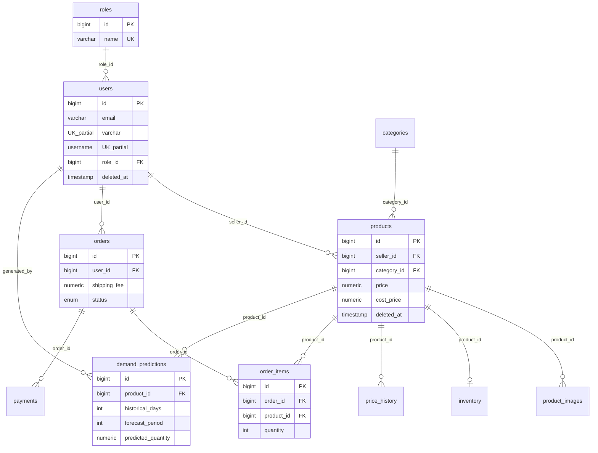
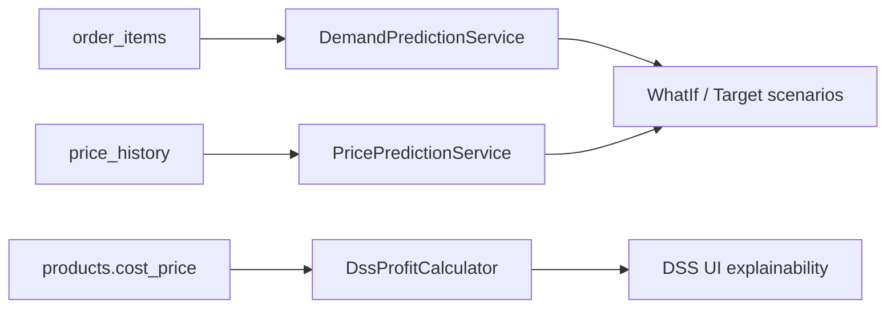

# SEDSP — ERD (Entity Relationship Diagram)

> **Tách biệt với schema:** Mô tả cột chi tiết xem [`DATABASE_SCHEMA.md`](./DATABASE_SCHEMA.md).

## Sơ đồ quan hệ lõi (Mermaid)

## Luồng dữ liệu DSS

## Ghi chú trình bày báo cáo

1. **Slide/word:** dùng ERD (diagram) riêng — không chèn bảng cột dài vào cùng hình.
2. **Phụ lục:** dùng `DATABASE_SCHEMA.md` cho PK/FK/constraint.
3. PK = khóa chính, FK = khóa ngoại, UK_partial = unique có điều kiện `deleted_at IS NULL`.
