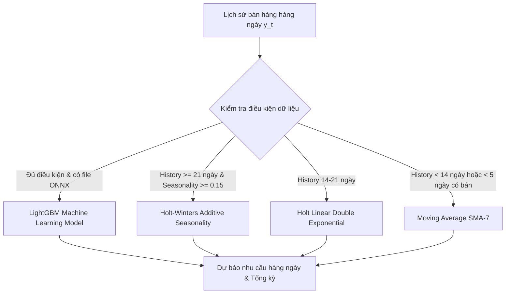

# TÀI LIỆU TOÁN HỌC & THUẬT TOÁN HỆ THỐNG HỖ TRỢ RA QUYẾT ĐỊNH (DSS)
**Hệ thống Thương mại Điện tử Thông minh (Smart E-Commerce DSSP)**

---

## MỤC LỤC
1. [Tổng quan Kiến trúc DSS](#1-tổng-quan-kiến-trúc-dss)
2. [Thuật toán Dự báo Nhu cầu (Demand Forecasting)](#2-thuật-toán-dự-báo-nhu-cầu-demand-forecasting)
   - 2.1. Mô hình Machine Learning: LightGBM (ONNX Runtime)
   - 2.2. Mô hình San bằng hàm mũ 3 tham số: Holt-Winters
   - 2.3. Mô hình Holt Linear Trend
   - 2.4. Mô hình Trung bình trượt (Moving Average - SMA)
   - 2.5. Cơ chế Tự động chọn Mô hình (Adaptive Selection)
3. [Độ co giãn của Cầu theo Giá ($E_d$ - Price Elasticity of Demand)](#3-độ-co-giãn-của-cầu-theo-giá-e_d---price-elasticity-of-demand)
   - 3.1. Cơ sở lý thuyết Kinh tế học
   - 3.2. Thuật toán Phân đoạn Chế độ Giá (Price Regimes)
   - 3.3. Công thức tính $E_d$ thực tế và Hệ số Fallback
4. [Mô phỏng & Tối ưu Kịch bản Giá bán (Advanced Price Scenario Simulation)](#4-mô-phỏng--tối-ưu-kịch-bản-giá-bán-advanced-price-scenario-simulation)
   - 4.1. Hệ số nhân Nhu cầu (Demand Multiplier)
   - 4.2. Công thức Lợi nhuận & Doanh thu kỳ vọng
   - 4.3. Phân tích Điểm cân bằng và Hành động đề xuất
5. [Mô hình Khuyến nghị Tồn kho (Inventory Recommendation)](#5-mô-hình-khuyến-nghị-tồn-kho-inventory-recommendation)
   - 5.1. Điểm đặt hàng lại (Reorder Point - ROP)
   - 5.2. Tồn kho an toàn (Safety Stock - SS)
6. [Sơ đồ Luồng Dữ liệu (Data Flow) & Tổng kết Code Backend](#6-sơ-đồ-luồng-dữ-liệu-data-flow--tổng-kết-code-backend)

---

## 1. TỔNG QUAN KIẾN TRÚC DSS

Hệ thống DSS được thiết kế theo cấu trúc **Hybrid Intelligence (Trí tuệ lai)**:
* **Machine Learning Layer**: Sử dụng mô hình cây quyết định tăng cường gradient **LightGBM** (được export sang định dạng chuẩn ONNX) để học các mẫu dữ liệu phi tuyến tính phức tạp và tương tác nhiều đặc trưng.
* **Statistical Time-Series Layer**: Mô hình chuỗi thời gian thống kê **Holt-Winters**, **Holt Linear**, và **Moving Average** đảm bảo tính toán ổn định, giải thích được (Explainable AI), và tự động kích hoạt khi dữ liệu huấn luyện ML chưa đủ.
* **Microeconomic Simulation Layer**: Mô hình vi mô dựa trên **Độ co giãn của cầu theo giá ($E_d$)** để mô phỏng tác động khi thay đổi giá đến sản lượng và lợi nhuận.

---

## 2. THUẬT TOÁN DỰ BÁO NHU CẦU (DEMAND FORECASTING)

*(Mã nguồn: `DemandForecastEngine.java` & `StatisticalForecastEngine.java`)*

### 2.1. Mô hình Machine Learning: LightGBM (ONNX Runtime)
Mô hình trích xuất vector đặc trưng (Feature Vector) gồm **14 chỉ số kỹ thuật**:

| Tên Đặc trưng | Ký hiệu | Công thức / Ý nghĩa |
| :--- | :--- | :--- |
| **Nhu cầu TB 7 ngày** | `recentAverageDailyDemand` | $\bar{y}_{7} = \frac{1}{7}\sum_{i=0}^6 y_{n-i}$ |
| **Nhu cầu TB 14 ngày** | `mediumAverageDailyDemand` | $\bar{y}_{14} = \frac{1}{14}\sum_{i=0}^{13} y_{n-i}$ |
| **Nhu cầu TB toàn kỳ** | `averageDailyDemand` | $\bar{y} = \frac{1}{n}\sum_{t=1}^n y_t$ |
| **Độ trễ 1 ngày (Lag 1)** | `lag1` | $y_{n}$ (Lượng bán của ngày gần nhất) |
| **Độ trễ 7 ngày (Lag 7)** | `lag7` | $y_{n-6}$ (Lượng bán của cùng thứ tuần trước) |
| **Đà tăng trưởng (Momentum)** | `momentum` | $\frac{\bar{y}_{7}}{\bar{y}_{14} + 1e-4}$ |
| **Tín hiệu mùa vụ tuần** | `seasonalSignal` | Tỷ lệ biến thiên giữa các ngày trong tuần so với trung bình chung |
| **Độ dốc xu hướng (Slope)** | `trendSlope` | Hệ số góc $\beta_1$ từ hồi quy tuyến tính OLS: $\beta_1 = \frac{\sum (t - \bar{t})(y_t - \bar{y})}{\sum (t - \bar{t})^2}$ |
| **Tồn kho hiện tại** | `currentStock` | Số lượng tồn kho thực tế của sản phẩm |
| **Độ dài lịch sử** | `historicalDays` | Số ngày quan sát ($7, 14, 30, 60, 180$) |
| **Khoảng dự báo** | `forecastDays` | Số ngày cần dự báo ($7, 14, 30$) |
| **Tỷ lệ giá / giá TB** | `priceRatio` | Tỷ lệ giữa giá hiện tại và giá bán bình quân |
| **Tồn kho / Nhu cầu TB** | `stockToDemandRatio` | $\frac{\text{Tồn kho}}{\bar{y} + 1e-4}$ |

---

### 2.2. Mô hình San bằng hàm mũ 3 tham số: Holt-Winters (Additive Seasonality)
Áp dụng khi dữ liệu có cả **Xu hướng (Trend)** và **Tính mùa vụ theo tuần (Weekly Seasonality, chu kỳ $m=7$)**.

#### Các tham số tối ưu trong hệ thống:
* Tham số san bằng mức nền (Level smoothing): $\alpha = 0.25$
* Tham số san bằng xu hướng (Trend smoothing): $\beta = 0.08$
* Tham số san bằng mùa vụ (Seasonality smoothing): $\gamma = 0.15$
* Chu kỳ tuần: $m = 7$

#### Khởi tạo ban đầu:
* Mức nền ban đầu: $\ell_0 = \frac{1}{m} \sum_{i=1}^m y_i$
* Xu hướng ban đầu: $b_0 = \frac{1}{m} \left( \frac{\sum_{i=m+1}^{2m} y_i}{m} - \frac{\sum_{i=1}^m y_i}{m} \right)$
* Chỉ số mùa vụ ban đầu: $s_i = y_i - \ell_0 \quad (i = 1, 2, \dots, m)$

#### Bộ phương trình cập nhật đệ quy qua từng ngày $t = 1 \dots n$:
1. **Cập nhật Mức nền (Level)**:
   $$\ell_t = \alpha (y_t - s_{t-m}) + (1 - \alpha)(\ell_{t-1} + b_{t-1})$$
2. **Cập nhật Độ dốc xu hướng (Trend)**:
   $$b_t = \beta (\ell_t - \ell_{t-1}) + (1 - \beta) b_{t-1}$$
3. **Cập nhật Thành phần mùa vụ (Seasonal Component)**:
   $$s_t = \gamma (y_t - \ell_t) + (1 - \gamma) s_{t-m}$$

#### Phương trình dự báo cho $h$ ngày trong tương lai:
$$\hat{y}_{t+h} = \max\Big(0, \; \ell_t + h \cdot b_t + s_{t+h-m}\Big)$$

---

### 2.3. Mô hình Holt Linear Trend
Áp dụng khi dữ liệu có xu hướng tăng/giảm nhưng chu kỳ mùa vụ chưa rõ rệt.
* $\alpha = 0.35, \quad \beta = 0.12$
* $\ell_t = \alpha y_t + (1 - \alpha)(\ell_{t-1} + b_{t-1})$
* $b_t = \beta (\ell_t - \ell_{t-1}) + (1 - \beta) b_{t-1}$
* Dự báo: $\hat{y}_{t+h} = \max(0, \; \ell_t + h \cdot b_t)$

---

### 2.4. Mô hình Trung bình trượt (Moving Average - SMA-7)
Áp dụng cho dữ liệu ngắn ($< 14$ ngày) hoặc sản phẩm mới đăng bán:
$$\hat{y}_{t+h} = \frac{1}{k} \sum_{i=0}^{k-1} y_{n-i} \quad \text{với } k = \min(7, n)$$

---

### 2.5. Cơ chế Tự động chọn Mô hình (Adaptive Selection)
Độ mạnh mùa vụ theo tuần ($S_{\text{strength}} \in [0, 1]$) được đo bằng:
$$S_{\text{strength}} = \min\left(1.0, \; \frac{\frac{1}{7} \sum_{d=0}^6 |\bar{y}_{\text{thứ } d} - \bar{y}_{\text{chung}}|}{\bar{y}_{\text{chung}}}\right)$$

* Nếu $n < 14$ hoặc số ngày bán được $< 5$ $\rightarrow$ **Moving Average**.
* Nếu $n \ge 21$ và $S_{\text{strength}} \ge 0.15$ $\rightarrow$ **Holt-Winters**.
* Ngược lại $\rightarrow$ **Holt Linear**.

---

## 3. ĐỘ CO GIÃN CỦA CẦU THEO GIÁ ($E_d$ - PRICE ELASTICITY OF DEMAND)

*(Mã nguồn: `PriceElasticityServiceImpl.java`)*

### 3.1. Cơ sở lý thuyết Kinh tế học
Độ co giãn của cầu theo giá đo lường mức độ phản ứng của lượng cầu hàng hóa khi giá của chính hàng hóa đó thay đổi:
$$E_d = \frac{\% \Delta Q}{\% \Delta P} = \frac{\frac{Q_2 - Q_1}{Q_1}}{\frac{P_2 - P_1}{P_1}}$$

Theo quy luật cầu (Law of Demand), khi giá tăng thì lượng cầu giảm, do đó $E_d \le 0$:
* **$|E_d| > 1$ (Cầu co giãn nhiều - Elastic)**: Phần trăm lượng cầu biến động lớn hơn phần trăm đổi giá. Giảm giá sẽ làm tăng tổng doanh thu.
* **$|E_d| < 1$ (Cầu kém co giãn - Inelastic)**: Khách hàng ít nhạy cảm với giá (hàng thiết yếu, hàng độc quyền). Tăng giá sẽ làm tăng tổng doanh thu.
* **$|E_d| = 1$ (Co giãn đơn vị - Unitary Elastic)**: Tỷ lệ thay đổi giá và lượng cầu bằng nhau.

---

### 3.2. Thuật toán Phân đoạn Chế độ Giá (Price Regimes)
Thay vì dùng giả định tĩnh, hệ thống quét bảng lịch sử giá `price_history` của sản phẩm để chia thành các **Chế độ giá liên tiếp $R_1, R_2, \dots, R_k$**:

1. **Với mỗi chế độ $R_i$**:
   * Giá bán áp dụng: $P_i$
   * Khoảng thời gian: từ $T_{\text{start}}$ đến $T_{\text{end}}$ (số ngày $N_i = \text{ChronoUnit.DAYS} + 1$)
   * Tổng lượng bán: $Q_i$
   * Nhu cầu trung bình ngày: $\bar{D}_i = \frac{Q_i}{N_i}$

2. **Tính độ co giãn giữa 2 chế độ liền kề $R_{i-1}$ và $R_i$**:
   $$\Delta P_{\text{rate}} = \frac{P_i - P_{i-1}}{P_{i-1}}, \qquad \Delta D_{\text{rate}} = \frac{\bar{D}_i - \bar{D}_{i-1}}{\bar{D}_{i-1}}$$
   $$E_{d, i} = - \left| \frac{\Delta D_{\text{rate}}}{\Delta P_{\text{rate}}} \right|$$

3. **Hệ số co giãn trung bình của sản phẩm**:
   $$\bar{E}_d = \frac{1}{k - 1} \sum_{i=2}^k E_{d, i}$$

---

### 3.3. Hệ số Fallback khi thiếu biến động giá
Nếu sản phẩm chưa từng đổi giá trong lịch sử ($k < 2$), hệ thống tự động kích hoạt **Fallback chuẩn**:
* Hệ số mặc định: $\bar{E}_d = -1.15$ đến $-1.25$ (mức nhạy cảm trung bình trong thương mại điện tử tiêu dùng).

---

## 4. MÔ PHỎNG & TỐI ƯU KỊCH BẢN GIÁ BÁN (ADVANCED PRICE SCENARIO SIMULATION)

*(Mã nguồn: `AdvancedPriceAnalysisServiceImpl.java`)*

Khi người bán tạo phiên mô phỏng với mức đổi giá $\Delta P_\% \in [-70\%, +100\%]$:

### 4.1. Công thức chi tiết

#### 1. Giá mô phỏng mới:
$$P_{\text{mới}} = P_{\text{gốc}} \times \left(1 + \frac{\Delta P_\%}{100}\right)$$

#### 2. Hệ số nhân Nhu cầu (Demand Multiplier - $M$):
$$M = \max\left(0, \; 1 + \bar{E}_d \times \frac{\Delta P_\%}{100}\right)$$

#### 3. Nhu cầu dự báo mới theo giá mới ($D_{\text{mới}}$):
$$D_{\text{mới}} = \text{round}\Big(D_{\text{baseline}} \times M\Big)$$
*(Trong đó $D_{\text{baseline}}$ là tổng lượng cầu dự báo từ mô hình LightGBM/Holt-Winters trong kỳ $7, 14, 30$ ngày).*

#### 4. Lợi nhuận trên 1 đơn vị sản phẩm ($\pi_{\text{unit}}$):
$$\pi_{\text{unit}} = P_{\text{mới}} - \text{Giá vốn (Cost Price)} - \text{Chi phí đơn ước tính (Order Cost)}$$

#### 5. Tổng Lợi nhuận kỳ vọng ($\Pi_{\text{kỳ vọng}}$):
$$\Pi_{\text{kỳ vọng}} = \pi_{\text{unit}} \times D_{\text{mới}}$$

#### 6. Tổng Doanh thu kỳ vọng ($R_{\text{kỳ vọng}}$):
$$R_{\text{kỳ vọng}} = P_{\text{mới}} \times D_{\text{mới}}$$

---

### 4.2. Ví dụ Minh họa Số học

Giả sử một sản phẩm có thông số:
* Giá hiện tại $P_{\text{gốc}} = 100.000$ đ
* Giá vốn $\text{Cost} = 60.000$ đ, Chi phí đóng gói/vận hành $\text{OrderCost} = 5.000$ đ
* Nhu cầu dự báo gốc trong 30 ngày: $D_{\text{baseline}} = 100$ sản phẩm
* Hệ số co giãn: $\bar{E}_d = -1.2$

| Kịch bản $\Delta P_\%$ | Giá mới $P_{\text{mới}}$ | Hệ số $M$ | Nhu cầu $D_{\text{mới}}$ | Lãi / SP $\pi_{\text{unit}}$ | Doanh thu $R$ | Tổng Lợi nhuận $\Pi$ | Đánh giá |
| :---: | :---: | :---: | :---: | :---: | :---: | :---: | :--- |
| **Giảm -10%** | 90.000 đ | $1 + (-1.2)(-0.1) = 1.12$ | 112 sp | 25.000 đ | 10.080.000 đ | 2.800.000 đ | Đẩy mạnh lượng bán |
| **Giữ nguyên 0%** | 100.000 đ | $1.00$ | 100 sp | 35.000 đ | 10.000.000 đ | 3.500.000 đ | Mức cơ sở hiện tại |
| **Tăng +5%** | 105.000 đ | $1 + (-1.2)(0.05) = 0.94$ | 94 sp | 40.000 đ | 9.870.000 đ | **3.760.000 đ** | **Tối ưu lợi nhuận cao nhất** |
| **Tăng +20%** | 120.000 đ | $1 + (-1.2)(0.20) = 0.76$ | 76 sp | 55.000 đ | 9.120.000 đ | 4.180.000 đ | Cầu giảm mạnh, rủi ro tồn kho |

---

## 5. MÔ HÌNH KHUYẾN NGHỊ TỒN KHO (INVENTORY RECOMMENDATION)

*(Mã nguồn: `DssAnalyticsService.java`)*

### 5.1. Điểm đặt hàng lại (Reorder Point - ROP)
$$ROP = (d \times L) + SS$$
* $d$: Nhu cầu trung bình hàng ngày (Average Daily Demand)
* $L$: Thời gian chờ giao hàng từ nhà cung ứng (Lead Time - mặc định 3 ngày)
* $SS$: Lượng tồn kho an toàn (Safety Stock)

### 5.2. Tồn kho an toàn (Safety Stock - SS)
$$SS = Z \times \sigma_d \times \sqrt{L}$$
* $Z$: Hệ số mức độ phục vụ (Service Level Factor, $Z \approx 1.65$ cho mức phục vụ $95\%$)
* $\sigma_d$: Độ lệch chuẩn của nhu cầu hàng ngày
* Hệ thống tính nhanh: $SS = \text{round}(d \times 0.5 \times \sqrt{L})$

### 5.3. Số lượng nhập hàng đề xuất ($Q_{\text{đề xuất}}$)
$$Q_{\text{đề xuất}} = \max\Big(0, \; (d \times T_{\text{kỳ hoạch định}} + SS) - \text{Tồn kho hiện tại}\Big)$$

---

## 6. SƠ ĐỒ LUỒNG DỮ LIỆU & TỔNG KẾT CODE BACKEND

| Phân hệ DSS | File Java đảm nhiệm | Đầu vào chính | Đầu ra chính |
| :--- | :--- | :--- | :--- |
| **Dự báo Nhu cầu** | `DemandForecastEngine.java` | Lịch sử bán `order_items`, `orders`, ngày lễ, tồn kho | Chuỗi ngày dự báo, tổng cầu, phương pháp ML/Stats |
| **Thống kê Chuỗi thời gian** | `StatisticalForecastEngine.java` | Chuỗi số lượng bán theo ngày, chu kỳ tuần $m=7$ | Dự báo Holt-Winters, Holt Linear, SMA |
| **Tính Độ co giãn** | `PriceElasticityServiceImpl.java` | `price_history`, đơn hàng theo từng khoảng giá | Hệ số co giãn trung bình $\bar{E}_d$, lượng bán |
| **Mô phỏng Giá nâng cao** | `AdvancedPriceAnalysisServiceImpl.java` | Mức đổi giá $\Delta P_\%$, giá vốn, chi phí đơn | Nhu cầu mô phỏng, lợi nhuận kỳ vọng $\Pi$, kịch bản |
| **Khuyến nghị Tồn kho** | `DssAnalyticsService.java` | Tồn kho hiện tại, nhu cầu TB ngày, kỳ hoạch định | Điểm đặt hàng lại (ROP), số lượng nhập đề xuất |

---
*Tài liệu này được biên soạn cho hệ thống Smart E-Commerce DSSP. Mọi công thức đều được đồng bộ và kiểm chứng qua hệ thống Unit Test tự động.*
